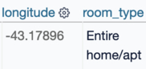

1. O que é o Datasette?
2. Por que usar o Datasette?
3. Instalação
4. Funções básicas
5. Explorando alguns plugins
6. Publicando e compartilhando dados na internet
7. Considerações sobre a ferramenta e este tutorial

----

#### 1. O que é o [Datasette](https://datasette.io/)?

Datasette é uma ferramenta de código livre e aberto que permite explorar dados e publicá-los online. O que significa isto?  Imagine um software híbrido que integra a simplicidade da tabela dinâmica, a funcionalidade e sintaxe de SQLite, e a facilidade de publicar/achar dados das APIs. 

Na sua essência, o Datasette é uma ferramenta feita para que a exploração, análise e compartilhamento de dados seja mais intuitiva e fácil. Tecnicamente é uma interface montada sobre uma base de dados estruturada/relacional, e tudo o que você vê no Datasette pode ser exportado em diferentes formatos.

Fora das capacidades funcionais  —já vamos falar mais delas—, o Datasette também é um ecosistema de ferramentas  criadas ao redor da exploração dos limites do que pode ser feito com tabelas de SQLite como formato para publicar e compartilhar dados.

Segundo seu criador, Simon Willison, [Datasette](www.datasette.io):

> (...)  ajuda às pessoas a capturar dados de qualquer forma ou tamanho, analisá-los, explorá-los, e publicá-los como um site interativo e API de acompanhamento. 

O ecosistema do Datasette é constituído de [Tools = Ferramentas](https://datasette.io/tools) e de [Plugins = Adições](https://datasette.io/plugins). As *ferramentas* permitem criar e manipular bases de dados em diferentes formatos, e os *plugins* expandem as capacidades básicas do Datasette (formatos de exportação diferentes, opções de visualização, etc.). 

----

#### 2. Por que usar o Datasette?

Se você trabalha com bases de dados em SQLite, planilhas e arquivos .csv, ou outro tipo de programas, e/ou dashboards de análsise de bases de dados, o Datasette pode ser muito útil, especialmente pela facilidade que traz na exploração e publicação dos dados. Encontrar padrões, criar mapas, exportar diferentes queries e compartilhar bases de dados é muito simples com a ferramenta. 

Existem vários cenários de uso do Datassete. Não vamos entrar em detalhe sobre cada um deles (lembre-se que a documentação é sua melhor amiga para entender a ferramenta), mas vale a pena destacar o potencial da ferramenta. 

Neste tutorial vamos ver como usar o Datasette para fazer análises exploratórias, publicar dados e trabalhar com suas funções desde a perspectiva do jornalismo de dados.  Ainda, para Willinson, “O público ideal para Datasette são os jornalistas de dados”, já que a ferramenta pode “ajudá-los achar histórias nos dados e publicá-los online”. Por exemplo, organizações como ProPublica usam a ferramenta no seu trabalho. 

- [Para análises exploratórias](https://datasette.io/for/exploratory-analysis)
- [Para publicar dados](https://datasette.io/for/publishing-data)
- [Para prototipar rápidamente](https://datasette.io/for/rapid-prototyping)
- [Para Jornalismo de dados](https://datasette.io/for/data-journalism)
- [Para procurar registros ou texto](https://datasette.io/for/search)
- [Para criar sites](https://datasette.io/for/websites)
- [Para criar bases de dados sem a necessidade de um servidor externo](https://datasette.io/for/serverless)


-----

#### 3. Instalação

Existem várias formas de instalar o Datasette na sua máquina (seja Mac o Windows). Importante destacar que você precisa ter Python 3 instalado no computador e conocer os comandos básicos da [linha de comando](https://tutorial.djangogirls.org/pt/intro_to_command_line/). Neste tutorial vamos a instalar o software com [Homebrew](https://brew.sh/). Para realizar esta instalação você precisa usar seu Terminal (no Mac). 

**Se você não quiser instalar a ferramenta, mas quiser mexer e testar as funcionalidades, você pode:**

- [Mexer no demo  diretamente no browser](https://fivethirtyeight.datasettes.com/fivethirtyeight)

- [Remixar o projeto no Glitch](https://docs.datasette.io/en/latest/getting_started.html#getting-started-glitch). Vale a pena mencionar que [no Glitch)](https://docs.datasette.io/en/latest/getting_started.html#getting-started-glitch) você pode subir seu próprio arquivo .csv e ficar brincando com o Datasette sem ter que criar seu ambiente de instalação.

Se você não tem Python 3 instalado na sua máquina, recomendo seguir os tutoriais do [Programming Historian em português](https://programminghistorian.org/pt/licoes/instalacao-mac).

#### Instalando o Datasette na sua máquina

1. Instalar o Homebrew. Ele funciona como um gestor de instalação. Abra seu terminal, copie e cole o seguinte código:

```python
/bin/bash -c "$(curl -fsSL https://raw.githubusercontent.com/Homebrew/install/HEAD/install.sh)"
```

2. Continuando no Terminal, copie e cole o seguinte código para instalar o Datasette:

```python
brew install datasette
```


- Como eu já instalei o Datasette, meu comando mudou para <code>brew reinstall datasette</code>. 
- Para confirmar se você tem a última versão disponível, digite no Terminal:

```python
datasette --version
```

Se você precisar atualizar sua versão do Homebrew, copie e cole:

```python
brew upgrade datasette
```

Para atualizar a versão do Datasette, simplesmente digite no seu Terminal:

```python
datasette install -U datasette
```

3. Após ter instalado a ferramenta, você poder começar instalar alguns dos plugins. Como mencionei anteriormente, os plugins são adições que permitem que o Datasette ganhe súper poderes. Hoje o Datasette tem 63 plugins disponíveis. 

   - Você pode instalar plugins com o seguinte comando <code>datasette install</code> + o nome do plugin, por exemplo:

    <code>datasette install datasette-leaflet-freedraw</code>. 

- Também pode desinstalar plugins <code>datasette uninstall</code>  e atualizá-los <code>datasette install --upgrade</code>. 

----

#### 4. Funções básicas

Vamos usar os dados do AirBnB do Rio de Janeiro para explorar algumas das funcionalidades do Datasette.

- Baixar o arquivo [listings.csv.gz](http://data.insideairbnb.com/brazil/rj/rio-de-janeiro/2021-03-21/data/listings.csv.gz)

Após baixar os dados, coloquei o arquivo .csv na no diretório do Datasette. Em seguida, no terminal, vamos aplicar el seguinte código para <u>transformar o arquivo csv numa base de dados SQLite</u>:

```python
csvs-to-sqlite meuarquivo.csv minhabasededados.db
```

- <code>meuarquivo.csv</code> debe ser o nome do arquivo csv que você quer transformar. Ele deve estar no seu diretório de trabalho. Você pode indicar o <code>PATH</code>, ou localização do arquivo. No meu caso o arquivo é **listings.csv**
- <code>minhabasededados.db</code> é o nome que você vai dar para essa base de dados em formato SQL. No meu caso o arquivo é **airbnbrio.db**

<u>Lembre-se que os dois arquivos (csv e db) precisam estar no diretório (pasta) do Datasette.</u> 


- Agora vamos abrir a base de dados no Datasette num servidor local, usando o seguinte comando: <code> datasette airbnbrio.db</code> — Após executar o comando, aparecerá um endereço *http* com uma sequência de números. Esse é o servidor local onde vai ser executado o Datsette. Copie e cole no seu browser. 


- Você também pode usar o comando <code>datasette minhabasededados.db -o</code> para abrir o arquivo automaticamente no seu browser

A interface do Datasette é muito simples e intuitiva. Na tela inicial do browser você vai encontrar: o nome da base de dados (<u>airbnbrio</u>), e o arquivo csv que alimenta essa base (<u>listings</u>). 


Se você clicar no nome da base de dados, você vai encontrar: um espaço de edição para fazer queries na linguagem de SQL e dois botões: “**Format SQL** = *Formatar SQL*” e “**Run SQL** = *Executar SQL*”. Embaixo vai ver as colunas do base de dados e, finalmente, o número de linhas.  


**Agora vamos explorar nossa base de dados**

Grande parte da facilidade de explorar dados no Datasette está baseada nas *Facets* ou Facetas. Você pode “facetar” — selecionar conjunto de dados  — diferentes variáveis da sua base de dados. Cada coluna tem um ícone para configurar e realizar ações. Você pode organizar os dados (ascendente e descendente, esconder uma coluna, facetar e alguns casos mostrar só fileiras com dados completos:


Você pode facetar várias colunas da sua base de dados. Para eliminar uma faceta, simplesmente clique no X do lado da faceta realizada:


Uma coisa muito legal do Datasette é que ele tem um editor de *queries* de SQ. Assim mesmo, qualquer tipo de faceta ou filtro que você execute na interface vai ser “traduzida” numa *query* de SQL. Para mim, que estou aprendendo SQL, essa é uma função maravilhosa! Você consegue tanto praticar SQLite executando *queries* sobre a base de dados, quanto entender a sintaxe de novas queries a partir das facetas realizadas.  

Neste caso eu apliquei uma faceta no <code>“room_type” = "Entire home/apt”</code>


Perceba que a cor dos dados é diferente, isto é porque cada tipo de dados (interger, texto) é identificado com uma cor diferente. No nosso exemplo os dados numéricos são cinzas e os textuais pretos:




----

#### 5. Explorando alguns plugins

Como mencionamos, o ecosistema do Datasette é muito amplo. A variedade de plugins que vem sendo desenvolvidos — você pode desenvolver o seu!](https://docs.datasette.io/en/stable/writing_plugins.html) —oferecem possibilidades de expandir as capacidades iniciais da ferramenta. 

Um dos meus plugins favoritos é o [Cluster Map](https://datasette.io/plugins/datasette-cluster-map), ele cria um mapa para você explorar espacialmente os dados. Para poder executar o Cluster Map, sua base de dados precisa ter uma coluna de Longitude e Latitude, e importante mencionar, os nomes dessas duas colunas precisam estar em inglês. 

Se suas colunas de coordenadas estão em outras línguas, você pode  aplicar um *query* de SQL para renomear as duas colunas ou usar o próximo plugin que vamos a explorar: **edit-schema**. 

Olha o legal que é explorar os dados com o Cluster Map:


Se você quiser editar sua tabela (eliminar e renomear colunas, mudar o tipo de dado, criar uma coluna), você pode usar o plugin [Edit-Schema](https://github.com/simonw/datasette-edit-schema):


Uma das melhores formas de explorar dados é criar visualizações. O Datasette tem um plugin chamado [Datasette-Vega](https://github.com/simonw/datasette-vega). Suas capacidades são limitadas (três tipos de visualização: barchart, linechart e scatterplot). 


Para uma visualização inicial funciona bem, mas se seu objetivo é produzir gráficos elaborados você pode instalar o plugin [Datasette Seaborn](https://datasette.io/plugins/datasette-seaborn), que usa o popular pacote para Python, ou exportar os resultados de suas queries em csv e usar algum programa para criar gráficos.

----

#### 6. Publicando e compartilhando os dados na internet

Neste tutorial vamos usar [Vercel](https://github.com/simonw/datasette-edit-schema) para publicar e compartilhar nossa base de dados. Vercel é uma plataforma de *deployment* e colaboração que permite publicar sites e serviços adicionais como apps —  e nossa base de dados — sem ter que configurar nada, além de ser gratuita*. 

Datasette também tem a possibilidade de publicar sua base de dados com Google Cloud e Heroku. 

**Por que publicar os dados?** Imagine que você está explorando uma base de dados para um artigo, matéria, ou pesquisa e quer compartilhar com seus colegas ou fazer o trabalho em conjunto. Melhor do que enviar os arquivos (csv e db) é compartilhar um link para explorar a base de dados no Datasette.

Para publicar seus dados com Vercel você precisa: 

1. Instalar o plugin de Vercel no mesmo ambiente que o Datasette: <code>datasette install datasette-publish-vercel</code>

2. Criar uma conta em [Vercel](https://vercel.com/) com seu email ou github 

3. Instalar Vercel na sua máquina seguindo as [instruções](https://vercel.com/cli):

   	 - Copiar e colar no Terminal: <code>npm i -g vercel</code> 

4. Copiar e colar no Terminal: <code>vercel login</code>

   - Fazer o login com sua conta 

5. Agora você pode publicar seus dados com o comando:

    <code>datasette publish vercel minhabasededados.db --project=nome-projeto</code>

   - Você tem que dar nome ao projeto. O argumento <code>--project</code> é obrigatório. 

<u>Importante mencionar que para que os plugins funcionem na versão publicada na internet você precisa instalá-los de novo:</u> 

```python
datasette publish vercel minhabasededados --project=nome-projeto --install=datasette-cluster-map
```

**A minha base de dados ficou hospeada nesse [link](https://tutorial-rio.vercel.app/airbnbrio/listings) criado pelo Vercel.** 

Montar uma base de dados num servidor é caro porque demanda de muita energia para fazer backups, executar queries, etc. Segundo o que consegui entender sobre o Vercel, existem diferentes tipo de contas (a minha de é de “Hobbie”) e sua capacidade gratuita do app criado para publicar a base de dados é de 15mb. Se você quiser subir uma base de dados maior, recomendo o Google Cloud, que tem mais capacidade.

--------

#### 7. Considerações sobre a ferramenta e o tutorial

É importante lembrar que este é um tutorial básico. Eu mesmo estou descobrindo a ferramenta e estudando SQL. Para uma pessoa mais experiente, o Datsette pode oferecer muitas funcionalidades imediatamente. 

Confeso que a configuração do módulo de publicação online foi sofrida porque primeiro tentei com Google Cloud e Heroku e não consegui instalar do jeito certo. Só consegui com Vercel, e mesmo dando certo, tive que passar por alguns passos de resintalação de livrarias e pacotes como <code>Node.js</code> e <code>npm</code>. 

Datasette tem muitas outras possibilidades e funções, além de todos os plugins que não usei até agora, que pretendo explorar em outros tutoriais, por exemplo: 

- Usar a API que gera a publicação dos dados online
- Personalizar templates com CSS

Como sempre, recomendo ler com atenção a documentação — que é muito robusta e bem explicada — e  assistir os [vídeos](https://simonwillison.net/2021/Feb/7/video/) de [apresentação](https://www.youtube.com/watch?v=UFn82w-97kI).

Boa exploração de dados!
